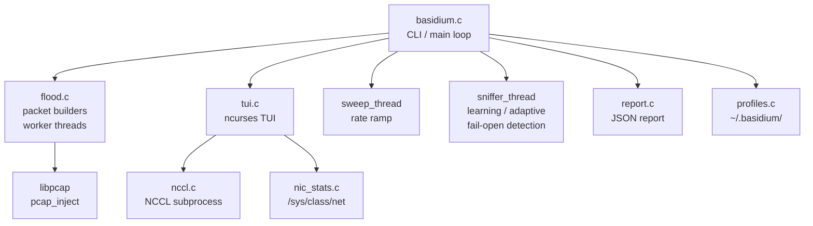
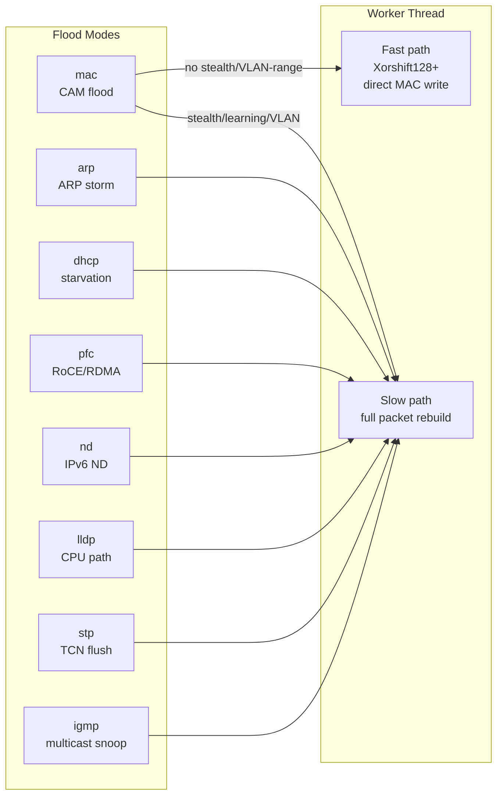
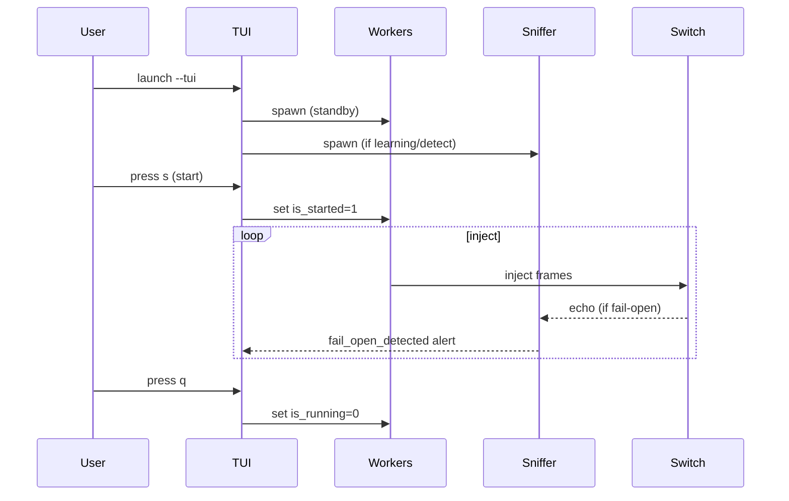
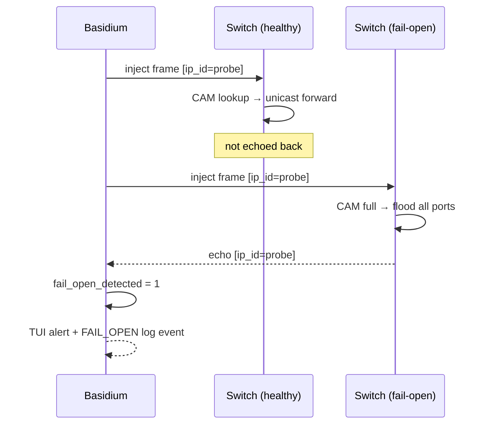
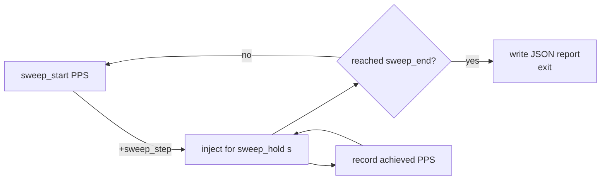

# Basidium v2.2

**Multi-threaded Layer-2 Stress & Hardware Evaluation Tool**

[](https://github.com/mstits/Basidium/actions/workflows/build.yml)
[](LICENSE)

## Why This Exists

Modern AI training and inference infrastructure depends on large GPU clusters interconnected by high-speed fabrics — typically RoCE or InfiniBand over 100/400 GbE. Collective communication libraries such as NCCL make heavy, continuous use of these fabrics during training: `allreduce`, `allgather`, `broadcast`, and related operations generate substantial traffic across multiple switch hops, with the exact pattern depending on the collective algorithm and topology in use.

In this environment, a single misbehaving switch, a misconfigured NIC, or a fabric policy error does not necessarily cause an obvious outage. Instead it can manifest as silent performance degradation — NCCL throughput drops, step times increase, and GPU utilization falls. These symptoms are often subtle and slow to develop, making root cause identification genuinely difficult.

This problem is not limited to initial bring-up. GPU cluster fabrics are complex systems whose behavior can drift over time: firmware updates, configuration changes, physical layer degradation, and incremental topology changes can all introduce regressions that were not present at initial qualification. Periodic re-validation is a practical necessity, not a one-time exercise.

Basidium exists to stress-test and validate this hardware at bring-up and throughout its operational life. It can:

- Saturate CAM tables to verify switch fail-open behavior and VLAN isolation under load
- Flood PFC PAUSE frames to confirm RoCE/RDMA priority flow control is correctly configured and does not deadlock under congestion — a known failure mode in lossless Ethernet fabrics
- Exhaust IGMP snooping and ARP tables to find resource limits before they surface in production
- Generate precise rate sweeps with JSON reporting to establish forwarding capacity baselines and detect regressions over time
- Run alongside NCCL collective tests to observe whether Layer-2 stress conditions measurably affect application-layer throughput — providing a side-by-side view that helps isolate whether a performance problem originates in the fabric

These are not theoretical failure modes. They are well-documented causes of degraded performance in dense GPU clusters that standard network qualification testing does not always exercise at the scale or intensity needed to surface them.

> **Authorization required.** Use only on airgapped hardware you own or have explicit written permission to test. Never run against production infrastructure or equipment belonging to others.

**Author:** Matthew Stits \<stits@stits.org\>  
**Repository:** https://github.com/mstits/Basidium

---

## Architecture







---

## Building

**Dependencies:** `libpcap-dev`, `libncurses-dev` (TUI only), `gcc`, `make`

```sh
# CLI only
make

# With ncurses TUI
make TUI=1

# Debug build
make debug

# Install to /usr/local
sudo make install

# Custom prefix
sudo make install PREFIX=/opt/local

# Self-test (11 packet builder tests)
sudo make selftest
```

**Platform notes:**
- Linux: fully supported; NIC TX/RX statistics read from `/sys/class/net/`
- macOS: CLI and TUI build and run correctly; NIC statistics panel shows `n/a` (no `/sys/class/net` equivalent)
- Raw packet injection requires root (`sudo`) on both platforms

---

## Quick Start

```sh
# MAC CAM flood, 4 threads
sudo ./basidium -i eth0 -t 4

# ARP broadcast storm at 5000 pps with TUI
sudo ./basidium -i eth0 -M arp -r 5000 --tui

# PFC PAUSE flood on RDMA priority 3
sudo ./basidium -i eth0 -M pfc

# IGMP snooping exhaustion
sudo ./basidium -i eth0 -M igmp -t 4

# STP TCN BPDU flood (forces MAC table flush)
sudo ./basidium -i eth0 -M stp

# IPv6 ND flood
sudo ./basidium -i eth0 -M nd -t 2

# QinQ double-tagging: outer VID 200, inner VID 100
sudo ./basidium -i eth0 -V 100 --qinq 200 -t 4

# Sweep 1k->50k pps, 5k steps, 10s hold, write report
sudo ./basidium -i eth0 --sweep 1000:50000:5000:10 --report

# Burst mode: 64-frame bursts with 100 ms gaps
sudo ./basidium -i eth0 --burst 64:100

# Flood VLANs 10-20 randomly
sudo ./basidium -i eth0 -V 10 --vlan-range 20 -t 4

# Fail-open detection + adaptive throttle
sudo ./basidium -i eth0 --detect -A
```

---

## Flood Modes (`-M`)

| Mode   | dst MAC              | EtherType | Effect |
|--------|----------------------|-----------|--------|
| `mac`  | random               | 0x0800    | Exhausts CAM table; switch degrades to hub |
| `arp`  | ff:ff:ff:ff:ff:ff    | 0x0806    | Floods ARP table |
| `dhcp` | ff:ff:ff:ff:ff:ff    | 0x0800    | Starves DHCP address pool |
| `pfc`  | 01:80:C2:00:00:01    | 0x8808    | Freezes RoCE/RDMA priority queues |
| `nd`   | 33:33:ff:xx:xx:xx    | 0x86DD    | Exhausts IPv6 ND/NDP table |
| `lldp` | 01:80:C2:00:00:0E    | 0x88CC    | Stresses switch CPU / LLDP daemon |
| `stp`  | 01:80:C2:00:00:00    | LLC       | Triggers repeated MAC table flushes |
| `igmp` | 01:00:5E:xx:xx:xx    | 0x0800    | Exhausts IGMP snooping table |

---

## All Options

### Interface & Performance
| Flag | Default | Description |
|------|---------|-------------|
| `-i <iface>` | required | Network interface |
| `-t <n>` | 1 | Worker threads (max 16) |
| `-r <pps>` | 0 (unlimited) | Rate limit packets/sec |
| `-J <bytes>` | 60 | Frame size (60-9216) |
| `-n <count>` | 0 (unlimited) | Stop after N frames |

### VLAN & PFC
| Flag | Default | Description |
|------|---------|-------------|
| `-V <id>` | 0 (untagged) | 802.1Q VLAN ID (1-4094) |
| `--vlan-pcp <0-7>` | 0 | 802.1p priority bits |
| `--vlan-range <end>` | — | Random VID per frame from `-V` to `end` |
| `--qinq <outer-vid>` | — | 802.1ad outer tag (combine with `-V` for double-tag) |
| `--pfc-priority <0-7>` | 3 | PFC priority class (3 = RDMA on Mellanox/NVIDIA) |
| `--pfc-quanta <val>` | 65535 | PFC pause duration (0-65535) |

### Stealth & Targeting
| Flag | Description |
|------|-------------|
| `-S <OUI>` | Restrict source MAC OUI (e.g. `00:11:22`) |
| `-T <CIDR>` | Embed IPs from subnet; repeatable up to 64 |
| `-L` | Learning mode — skip observed MACs |
| `-A` | Adaptive mode — throttle on broadcast storm |
| `-U` | Allow multicast source MACs |
| `-R` | Randomize DHCP client MAC independently |

### Burst & Advanced
| Flag | Description |
|------|-------------|
| `--burst <count:gap_ms>` | Send `count` frames at wire speed, pause `gap_ms` ms |
| `--detect` | Fail-open detection via embedded probe signature |
| `--payload <pattern>` | MAC flood payload: `zeros` `ff` `dead` `incr` |

### Rate Sweep
```
--sweep start:end:step[:hold_s]
```
Ramps injection rate from `start` to `end` PPS in `step` increments, holding each for `hold_s` seconds (default 10). Exits on completion and writes a JSON report.

### Output & Logging
| Flag | Description |
|------|-------------|
| `-v` | Verbose per-thread and live PPS |
| `-l <file>` | JSON event log |
| `--tui` | ncurses TUI (requires `make TUI=1`) |
| `--report [file]` | JSON session report on exit |
| `--pcap-out <file>` | Write frames to `.pcap` |
| `--pcap-replay <file>` | Replay `.pcap` onto interface |

### NCCL Correlation
| Flag | Description |
|------|-------------|
| `--nccl` | NCCL busbw correlation panel in TUI |
| `--nccl-binary <path>` | Path to nccl-tests binary (implies `--nccl`) |

### Profiles & Sessions
| Flag | Description |
|------|-------------|
| `--profile <name>` | Load `~/.basidium/<name>.conf` |
| `--duration <time>` | Auto-stop: `30`, `5m`, `2h` |

### Diagnostics
| Flag | Description |
|------|-------------|
| `--selftest` | Run 11 built-in validation tests |

---

## TUI

Launch with `--tui` (requires `make TUI=1`). Starts in **STANDBY** — no injection until you press `s` or Enter.

### Key Bindings
| Key | Action |
|-----|--------|
| `s` / Enter | Start injecting |
| Space | Pause / Resume |
| `q` | Quit |
| `?` | Help overlay |
| `p` | Profile menu |
| `+` / `=` | Rate +1000 pps |
| `-` | Rate -1000 pps |
| `o` | Set OUI prefix |
| `v` | Set VLAN ID |
| `n` | Toggle NCCL panel |
| `b` | Record NCCL baseline |
| `l` | Load `.pcap` for replay |

### Panels
- **Header** — mode, interface, `[STANDBY]`/`[RUNNING]`/`[PAUSED]`, blinking `[!FAIL-OPEN DETECTED!]` when triggered
- **Live Stats** — PPS, total frames, uptime, session countdown, sparkline, per-thread PPS, NIC tx/rx/drop/error
- **Config** — mode, rate or sweep progress, threads, OUI, VLAN/PFC settings
- **NCCL** — busbw, baseline, degradation% (with `--nccl`)
- **Log** — scrolling event log

---

## SNMP Integration

Basidium's JSON event log and session reports pair directly with SNMP polling to correlate injection activity with live switch MIB counters.

### Useful MIB OIDs

| Metric | MIB Object | OID |
|--------|-----------|-----|
| CAM discard events | `dot1dTpLearnedEntryDiscards` | 1.3.6.1.2.1.17.4.3.1.3 |
| CAM aging time | `dot1dTpAgingTime` | 1.3.6.1.2.1.17.4.2 |
| STP topology changes | `dot1dStpTopChanges` | 1.3.6.1.2.1.17.2.4 |
| Interface errors | `ifInErrors` | IF-MIB::ifInErrors |
| Interface discards | `ifInDiscards` | IF-MIB::ifInDiscards |
| IGMP group table | `igmpCacheTable` | 1.3.6.1.2.1.85.1.2 |

### Poll switch counters alongside a flood run

```bash
#!/bin/bash
# poll-snmp.sh — record CAM, STP, and interface counters during injection
SWITCH=192.168.1.1
COMMUNITY=public

while true; do
  TS=$(date +%s)
  CAM=$(snmpget -v2c -c $COMMUNITY $SWITCH \
    1.3.6.1.2.1.17.4.3.1.3.0 2>/dev/null | awk '{print $NF}')
  ERR=$(snmpget -v2c -c $COMMUNITY $SWITCH \
    IF-MIB::ifInErrors.1 2>/dev/null | awk '{print $NF}')
  STP=$(snmpget -v2c -c $COMMUNITY $SWITCH \
    1.3.6.1.2.1.17.2.4.0 2>/dev/null | awk '{print $NF}')
  echo "$TS cam_discards=$CAM if_errors=$ERR stp_topo_changes=$STP"
  sleep 1
done
```

```bash
# Terminal 1: start SNMP polling
./poll-snmp.sh | tee snmp-log.txt &

# Terminal 2: run Basidium sweep
sudo ./basidium -i eth0 --sweep 1000:100000:10000:5 --report sweep.json
```

### Python: correlate sweep report with SNMP

```python
#!/usr/bin/env python3
"""
Correlate basidium sweep JSON with live SNMP counters.
Requires: pip install pysnmp
"""
import json
from pysnmp.hlapi import *

SWITCH    = "192.168.1.1"
COMMUNITY = "public"
REPORT    = "sweep.json"

def snmp_get(oid):
    it = getCmd(
        SnmpEngine(),
        CommunityData(COMMUNITY, mpModel=1),
        UdpTransportTarget((SWITCH, 161)),
        ContextData(),
        ObjectType(ObjectIdentity(oid))
    )
    errorIndication, errorStatus, _, varBinds = next(it)
    if errorIndication or errorStatus:
        return None
    return int(varBinds[0][1])

with open(REPORT) as f:
    report = json.load(f)

print(f"Interface:  {report['interface']}")
print(f"Duration:   {report['duration_s']}s")
print(f"Total sent: {report['total_packets']:,}")
print(f"Peak PPS:   {report['peak_pps']:,}")
print()

cam  = snmp_get("1.3.6.1.2.1.17.4.3.1.3.0")
stp  = snmp_get("1.3.6.1.2.1.17.2.4.0")
errs = snmp_get("1.3.6.1.2.1.2.2.1.14.1")

print(f"CAM discards:        {cam}")
print(f"STP topo changes:    {stp}")
print(f"Interface errors:    {errs}")
print()

if report.get("sweep"):
    print("Sweep results:")
    for s in report["sweep"]:
        eff = s['achieved_pps'] / s['target_pps'] * 100
        print(f"  step {s['step']:>2}: {s['target_pps']:>8} pps target  "
              f"→  {s['achieved_pps']:>8} achieved  ({eff:.1f}%)")
```

### Watch STP TCN events during STP flood

```bash
# Capture SNMP traps from the switch
snmptrapd -f -Lo -c /etc/snmp/snmptrapd.conf &

# Run STP TCN flood
sudo ./basidium -i eth0 -M stp -r 100 -l events.json

# Count topology change traps received
grep -c "topologyChange" /var/log/snmptrapd.log
```

---

## Switch Fail-Open Detection (`--detect`)

Basidium embeds a random 16-bit probe signature in the IP ID field of every MAC-flood frame. The sniffer thread watches the interface; if a frame with that signature is received back, the switch has entered hub mode.



```sh
sudo ./basidium -i eth0 --detect -A --tui
```

---

## Rate Sweep & Reporting



```sh
sudo ./basidium -i eth0 --sweep 1000:100000:10000:5 --report /tmp/report.json
```

Example report:

```json
{
  "generated": "2026-04-02T22:00:00Z",
  "interface": "eth0",
  "mode": "mac",
  "threads": 1,
  "duration_s": 50,
  "total_packets": 4823000,
  "peak_pps": 98200,
  "sweep": [
    { "step": 1, "target_pps": 1000,  "achieved_pps": 999  },
    { "step": 2, "target_pps": 11000, "achieved_pps": 10998 }
  ]
}
```

---

## PFC PAUSE for RoCE/RDMA Testing

IEEE 802.3 MAC Control frame layout for PFC mode:

```
[dst: 01:80:C2:00:00:01 (6B)][src: random (6B)]
[EtherType: 0x8808 (2B)][Opcode: 0x0101 (2B)]
[Priority Enable Vector (2B)][quanta[0..7]: 16B]
[pad to 60B]
```

Default priority 3 is the standard lossless class on Mellanox/NVIDIA ConnectX and BlueField. Only the target priority bit is set in the PEV; all other quanta are zero.

```sh
sudo ./basidium -i eth0 -M pfc -V 100 --pfc-priority 3 --pfc-quanta 65535
```

---

## QinQ Double-Tagging

With `-V 100 --qinq 200` the wire format is:

```
[dst][src][0x88A8][outer TCI VID=200][0x8100][inner TCI VID=100][EtherType][payload]
```

Useful for provider bridges (802.1ad), metro Ethernet, and L2VPN stitching.

```sh
sudo ./basidium -i eth0 -V 100 --qinq 200 -t 4
```

---

## Named Profiles

Profiles are stored in `~/.basidium/` as key=value files. All fields — VLAN, PFC, sweep, burst, detect, QinQ, payload, threads, rate — are persisted.

```sh
# Save from TUI: press p → s → type name → Enter

# Load from CLI
sudo ./basidium --profile rdma-stress
sudo ./basidium --profile stp-flood
```

---

## Source Layout

```
basidium.c      main(), CLI parsing, thread orchestration
flood.c         packet builders, worker threads, sniffer, RNG, selftest
tui.c           ncurses TUI (make TUI=1)
nccl.c/.h       NCCL subprocess orchestration
profiles.c/.h   named profile save/load (~/.basidium/)
nic_stats.c/.h  NIC statistics (/sys/class/net/)
report.c/.h     JSON session report writer
flood.h         shared types, config struct, extern globals, prototypes
```

### Fast Path

In MAC flood mode without stealth, learning, or VLAN-range active, workers use Xorshift128+ to overwrite only the 12 MAC bytes of a pre-built frame template — no packet-builder overhead, near wire-rate throughput.

---

## Dependencies

| Library | Debian/Ubuntu | RHEL/Fedora |
|---------|--------------|-------------|
| libpcap | `libpcap-dev` | `libpcap-devel` |
| libpthread | standard | standard |
| libncurses | `libncurses-dev` | `ncurses-devel` (TUI only) |

---

## License

For authorized laboratory use.  
© Matthew Stits — https://github.com/mstits/Basidium
